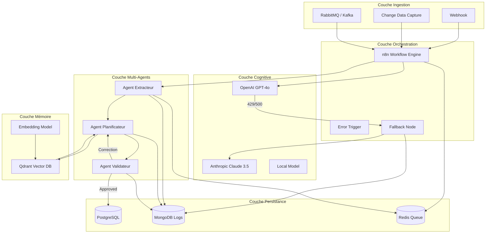
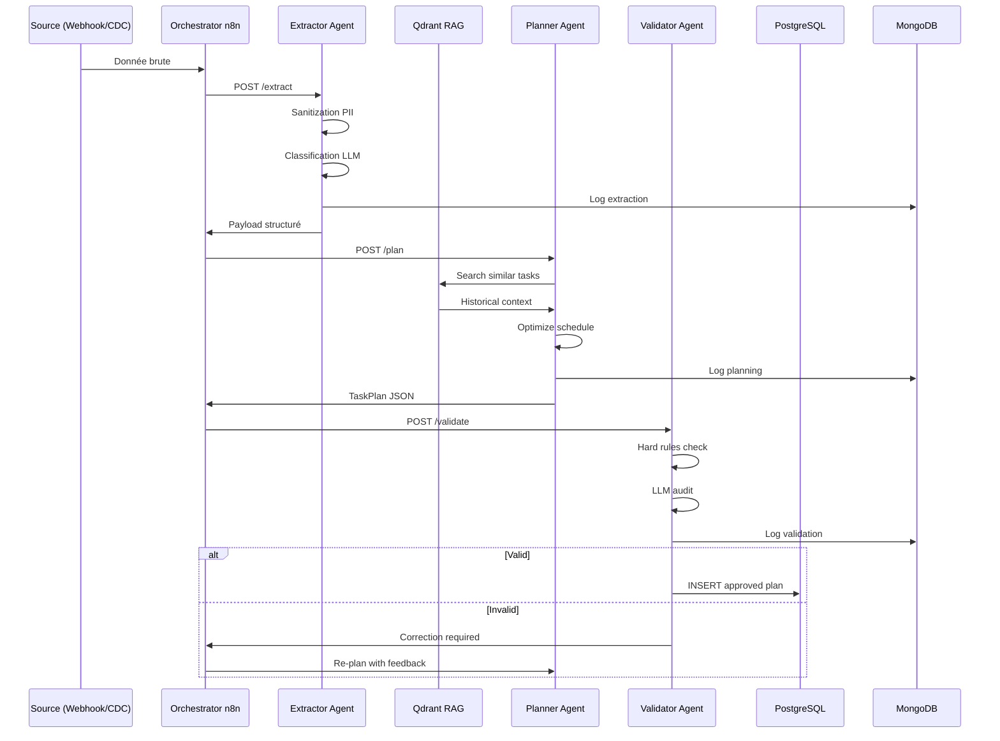

# Architecture Système — Project OMNI Enterprise

## 1. Vue d'ensemble

Project OMNI est une architecture **Event-Driven Micro-Agents** conçue pour l'orchestration de pipelines ETL d'entreprise avec capacités cognitives.

---

## 2. Diagramme de Composants (C4 - Level 2)

---

## 3. Flux de Données (Séquence)

---

## 4. Patterns Utilisés

| Pattern | Implémentation | Fichier |
|---------|---------------|---------|
| Circuit Breaker | `CircuitBreaker` class | `src/utils/circuit_breaker.py` |
| Fallback | `LLMClient` with catch | `src/utils/fallback.py` |
| Event Bus | Redis Pub/Sub | `src/utils/message_bus.py` |
| State Machine | JSON persistence | `src/utils/state_manager.py` |
| RAG | Qdrant + OpenAI embeddings | `src/rag/` |
| Graceful Degradation | n8n Error Trigger → Anthropic | `n8n-workflows/error-handling.json` |

---

## 5. Décisions d'Architecture (ADR)

### ADR-001 : Event-Driven vs CRON
**Décision** : Architecture event-driven (RabbitMQ + Webhooks) plutôt que CRON.
**Motivation** : Réactivité immédiate, scalabilité horizontale, traçabilité.

### ADR-002 : Qdrant vs Pinecone
**Décision** : Qdrant auto-hébergé en Docker.
**Motivation** : Souveraineté des données, coût nul, intégration on-premise.

### ADR-003 : n8n vs Airflow
**Décision** : n8n pour l'orchestration visuelle, Python natif pour la logique complexe.
**Motivation** : Rapidité de prototypage + puissance algorithmique.

---

## 6. Matrice de Dépendances

| Composant | Dépend de | Utilisé par |
|-----------|-----------|-------------|
| n8n | PostgreSQL, Redis | Webhooks, Agents |
| Agent Extracteur | LLM (Haiku), MongoDB | n8n |
| Agent Planificateur | GPT-4o, Qdrant | n8n |
| Agent Validateur | GPT-4o | n8n |
| Qdrant | - | Planner, RAG |
| PostgreSQL | - | n8n, ETL Output |
| MongoDB | - | Tous les agents |
| Redis | - | n8n, Message Bus |
