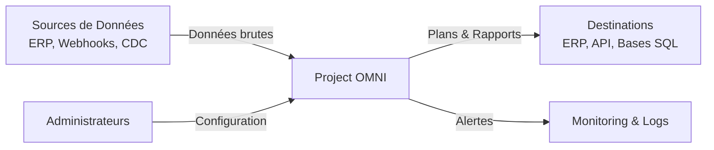
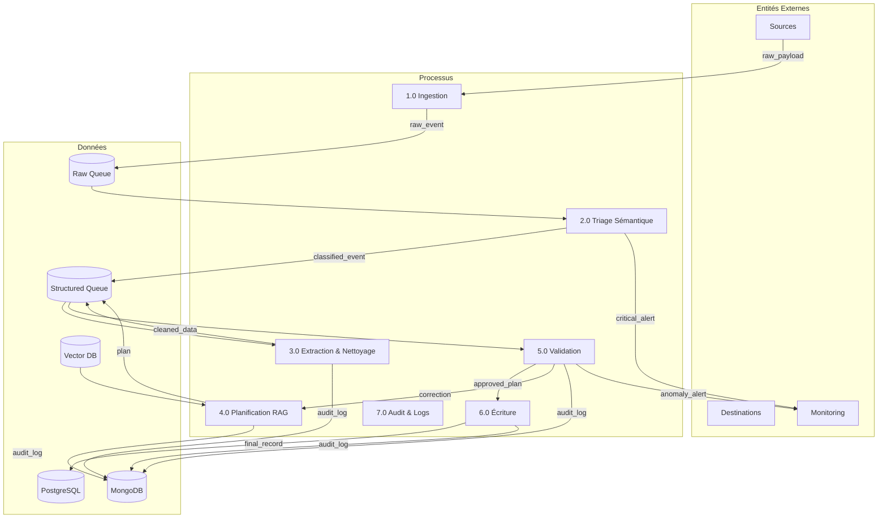
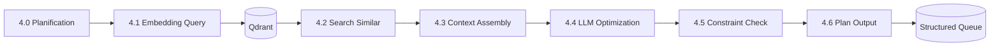

# Data Flow Diagram — Project OMNI Enterprise

## DFD Niveau 0 (Contexte)

## DFD Niveau 1 (Processus Principaux)

## DFD Niveau 2 — Processus 4.0 (Planification RAG)

---

## Table des Flux de Données

| Flux | Source | Destination | Type | Format | Fréquence |
|------|--------|-------------|------|--------|-----------|
| raw_payload | Webhook | Ingestion | Push | JSON | Variable |
| classified_event | Triage | Extraction | Queue | JSON | Temps réel |
| cleaned_data | Extraction | Planification | Queue | JSON | Temps réel |
| historical_context | Qdrant | Planification | Pull | Vector | À la demande |
| plan | Planification | Validation | Queue | JSON | Temps réel |
| correction | Validation | Planification | Feedback | JSON | Si invalide |
| approved_plan | Validation | PostgreSQL | Write | SQL | Temps réel |
| audit_log | Tous | MongoDB | Write | BSON | Continu |
| critical_alert | Triage | Monitoring | Push | JSON | Immédiat |
